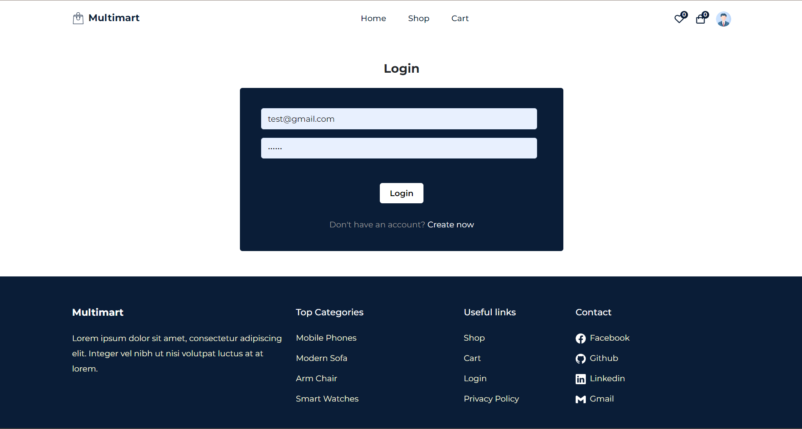

# FURNITURE

## 1. Description

- A furniture selling application using Reactjs, Firebase as Backend. This is a personal project focus on practicing react, redux, hooks and folder structure of a react app.

## 2. Installation and usage

-- How to run it?

- step 1: clone it to your local machine (https://github.com/emsiqh/furniture).
- step 2: open terminal -> cd to the project directory (cd funiture).
- step 3: go to client folder (cd client) -> (yarn add / npm install) to install all dependencies -> (yarn start / npm run dev).

## 3. Tech stack

- ReactJS (18), HTML, CSS, JavaScript, Redux, React Router v6, Firebase.

## Deployed version

- https://hfurniture-ecommerce.netlify.app

## 3. Some main functions

### 1. SHOP MAIN PAGE (include filtering by category and sorting by price function)

### 2. Cart (include filtering by category and sorting by price function)

### 3. Checkout PAGE (include filtering by category and sorting by price function)

### 4. Favorite items

### 4. Sign up

### 4.Sign in

